# 🛠️ Refrigestion (Aplicación Desktop)

Aplicación de escritorio desarrollada en **.NET 6 y Windows Forms** para la gestión de servicios técnicos y generación de reportes.  

Permite emitir un **PDF de garantía** con los datos del cliente, el equipo y el detalle del servicio realizado.  

---

## 🚀 Tecnologías
- .NET 6  
- Windows Forms  
- QuestPDF

---

## ✨ Funcionalidades
- Gestión de **clientes** y **equipos**  
- Registro de **servicios realizados**  
- Emisión de **reportes en PDF** a modo de garantía  
- Visualización de clientes, equipos y reportes guardados  

---

## 📸 Capturas de pantalla

### Menú principal
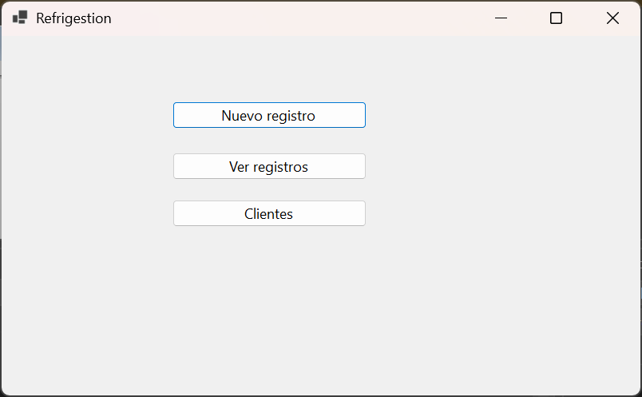

### Crear nuevo reporte
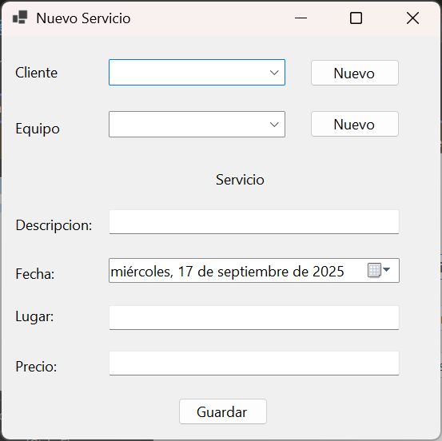

### Registrar un cliente
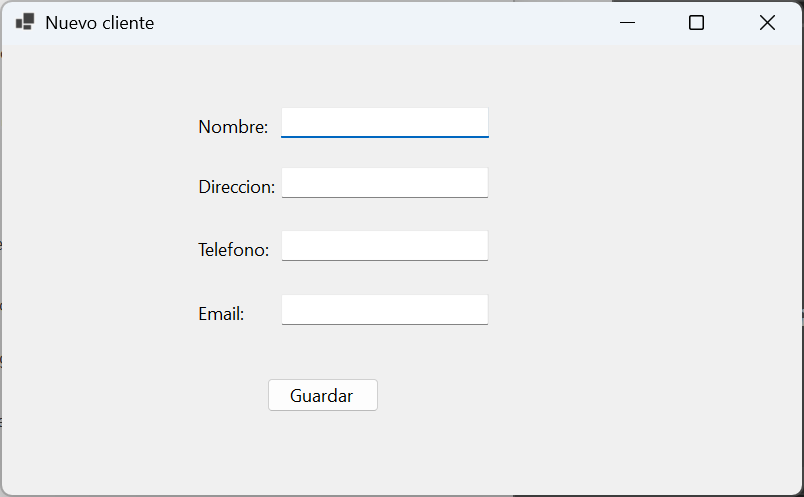  
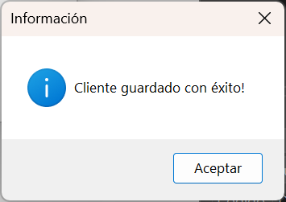

### Registrar un equipo
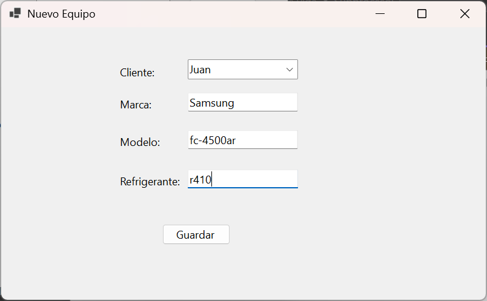  

### Guardar y visualizar un reporte
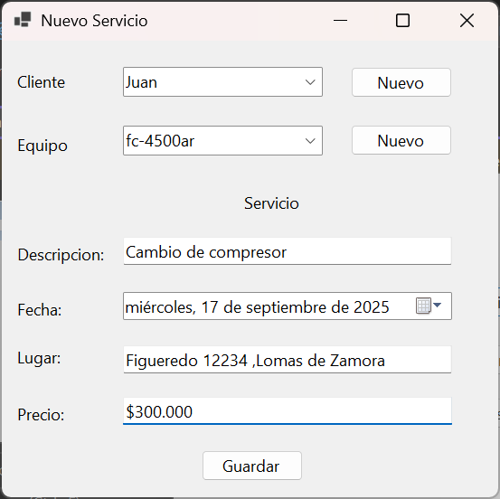  
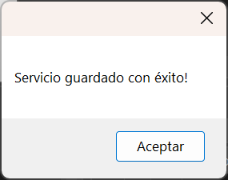

### Listado de reportes
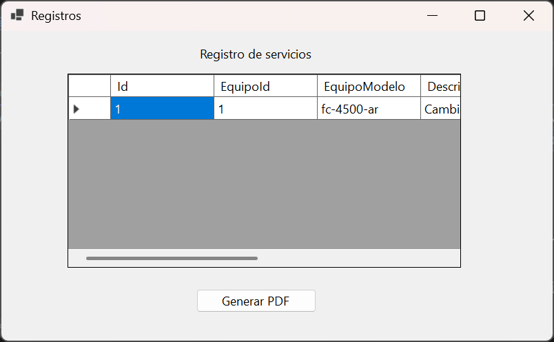

### Generar reporte en PDF
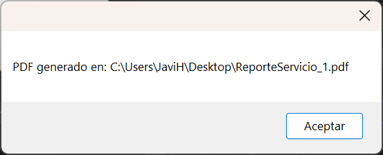  
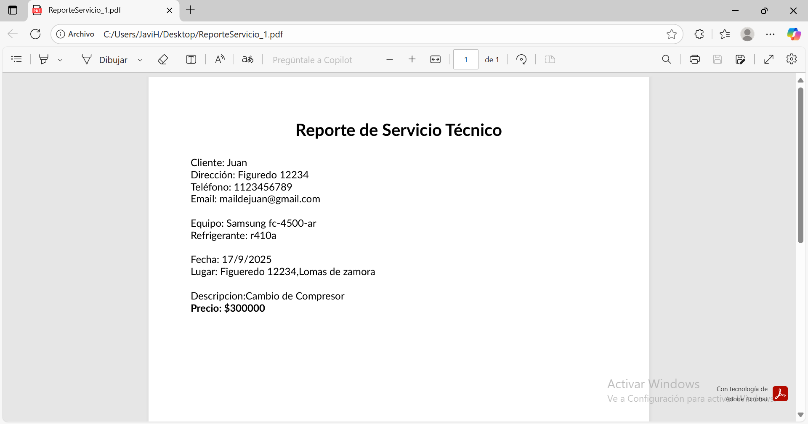

### Listado de clientes
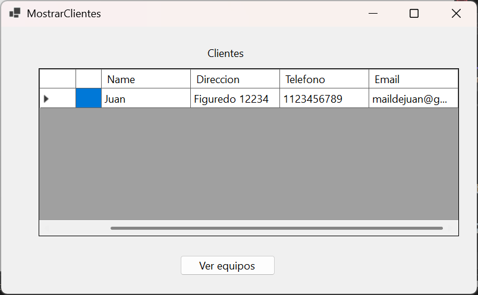

---

## 👨‍💻 Autor
Desarrollado por **Javier Aguirre**  
